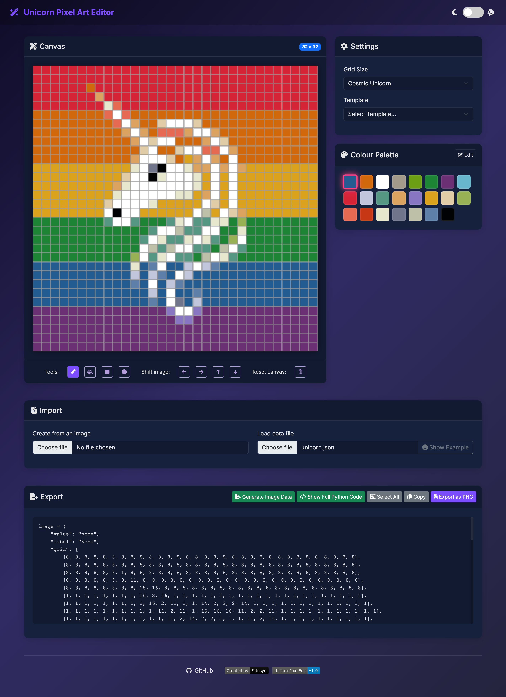

# Unicorn Pixel Art Editor

 

A powerful web-based editor for creating pixel art for [Pimoroni Unicorn LED panels](https://shop.pimoroni.com/products/space-unicorns). Supports all Unicorn display types with accurate pixel representation and easy-to-use tools.



## Features

- **Multi-Device Support**:
  - Stellar Unicorn (16x16)
  - Galactic Unicorn (53x11)
  - Cosmic Unicorn (32x32)

- **Drawing Tools**:
  - Click or drag to draw pixels
  - Customizable color palette
  - Shift controls (Left, Right, Up, Down)
  - Clear canvas function

- **Import/Export**:
  - Load from JSON files
  - Export as Python code
  - Export as PNG image
  - View example templates
  - Import from images

- **UI Features**:
  - Dark/Light theme support
  - Responsive design
  - Consistent pixel sizing
  - Real-time preview

## Getting Started

### Online Version
The quickest way to start is using our [online version](https://fotosyn.github.io/UnicornPixelEditor/).

### Local Installation
1. Clone the repository:
   ```bash
   git clone https://github.com/fotosyn/UnicornPixelEditor.git
   cd UnicornPixelEditor
   ```

2. Open `index.html` in your web browser.

No additional dependencies or setup required for basic usage.

## Usage Guide

### Basic Controls
1. Select your Unicorn display type from the "Grid Size" dropdown
2. Choose a color from the palette
3. Click or drag on the canvas to draw
4. Use shift buttons to move your design
5. Export your design as Python code or PNG image

### Working with Files
- **Load JSON**: Import existing designs
- **Export**: Generate Python code for your Unicorn display
- **Export PNG**: Save your design as a PNG image
- **Examples**: View sample templates for each display type

### Python Integration
1. Export your design using the "Generate Image Data" button
2. Copy the generated Python code
3. Paste into your Unicorn display's Python script
4. Run on your device

## Display Types

### Stellar Unicorn (16x16)
- Perfect for small icons and symbols
- 256 total pixels
- Square aspect ratio

### Galactic Unicorn (53x11)
- Ideal for scrolling text and wide designs
- 583 total pixels
- Wide aspect ratio

### Cosmic Unicorn (32x32)
- Best for detailed pixel art
- 1024 total pixels
- Square aspect ratio

## Development

### Project Structure
```
UnicornPixelEditor/
├── index.htm          # Main HTML file
├── script.js          # Core JavaScript functionality
├── styles.css         # CSS styles
├── theme-switcher.js  # Theme handling
├── images.json        # Template data
└── example.json       # Example templates
```

### Contributing
1. Fork the repository
2. Create your feature branch
3. Commit your changes
4. Push to the branch
5. Create a Pull Request

## Using with Pimoroni Unicorn

### Required Hardware
- Any Pimoroni Unicorn LED panel
- Raspberry Pi Pico
- USB cable

### Software Setup
1. Install Thonny IDE
2. Install Pimoroni MicroPython
3. Connect your Unicorn display
4. Copy the generated Python code
5. Run on your device

## Resources

- [Pimoroni Unicorn Documentation](https://shop.pimoroni.com/products/space-unicorns)
- [MicroPython Documentation](https://docs.micropython.org/)
- [Thonny IDE](https://thonny.org/)

## License

This project is licensed under the MIT License - see the [LICENSE](LICENSE) file for details.

## Acknowledgments

- Created by [Fotosyn](https://github.com/fotosyn/)
- Contributors and community members
- Pimoroni for their excellent LED displays
